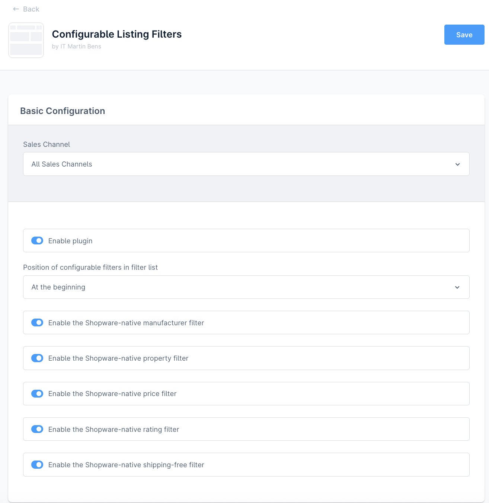
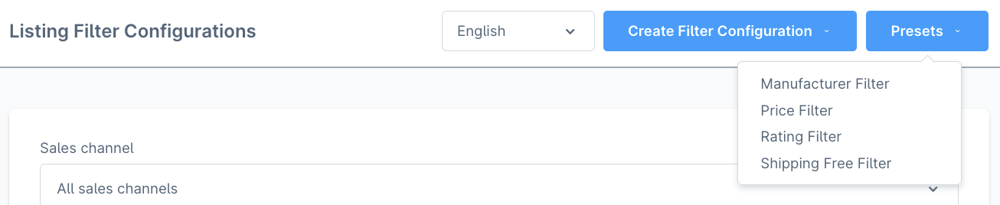
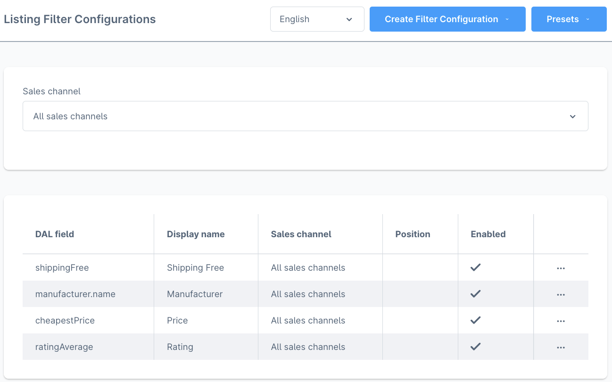
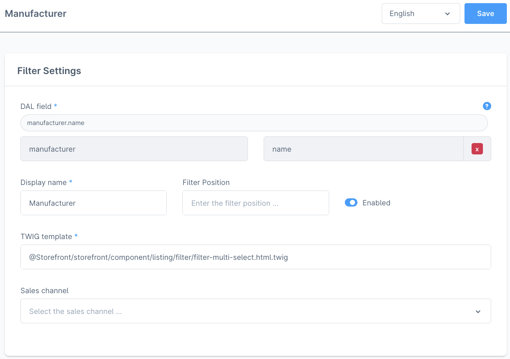
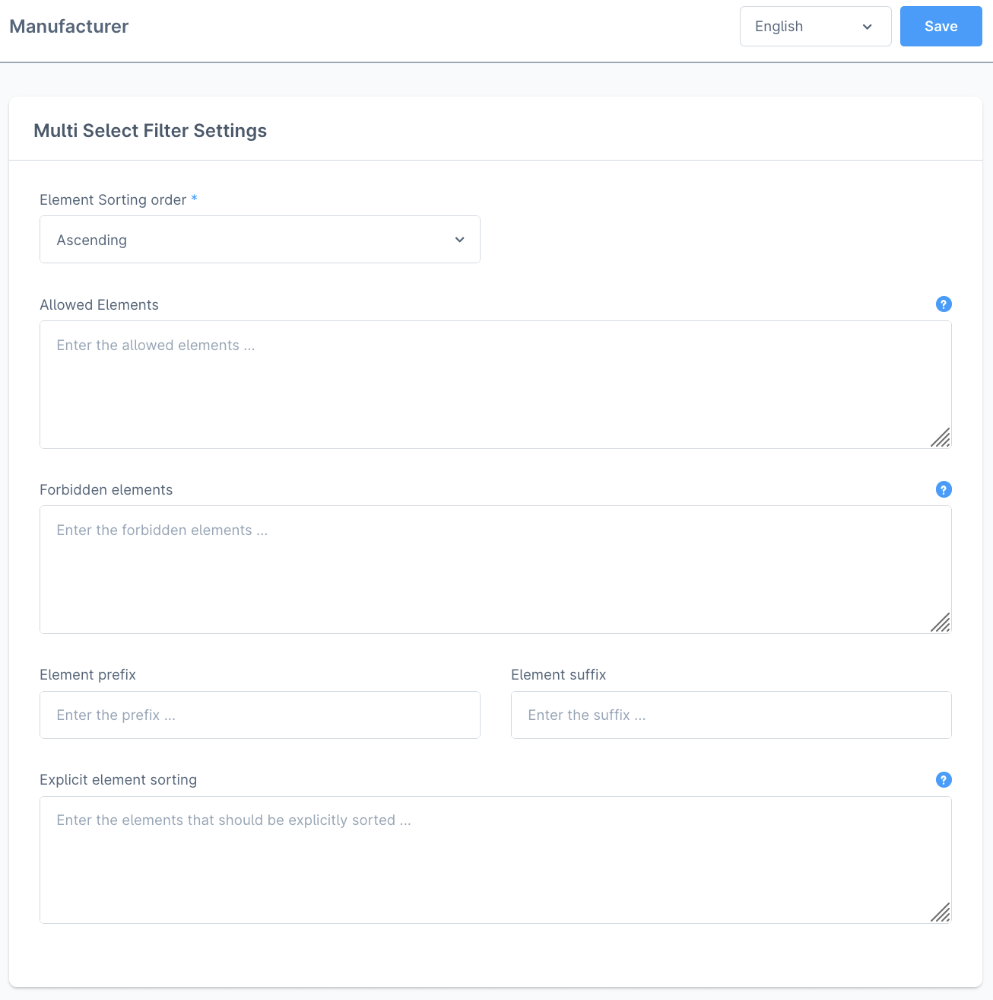
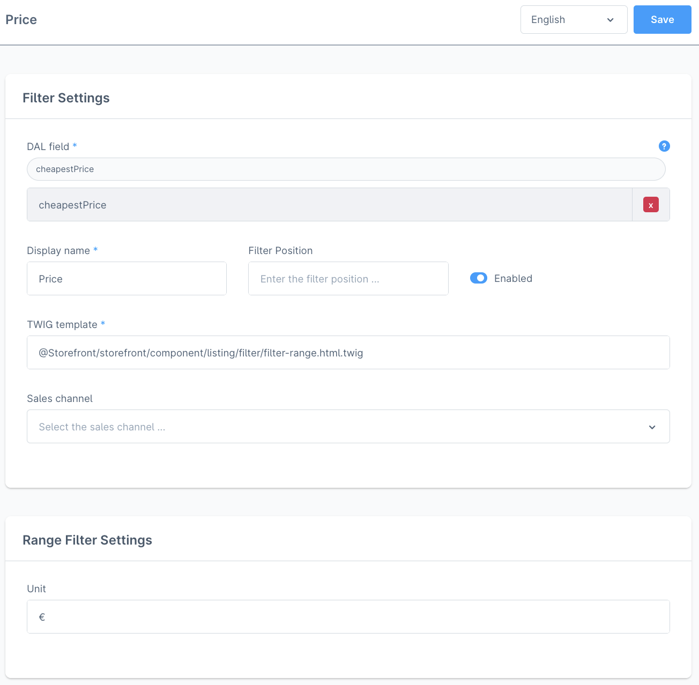
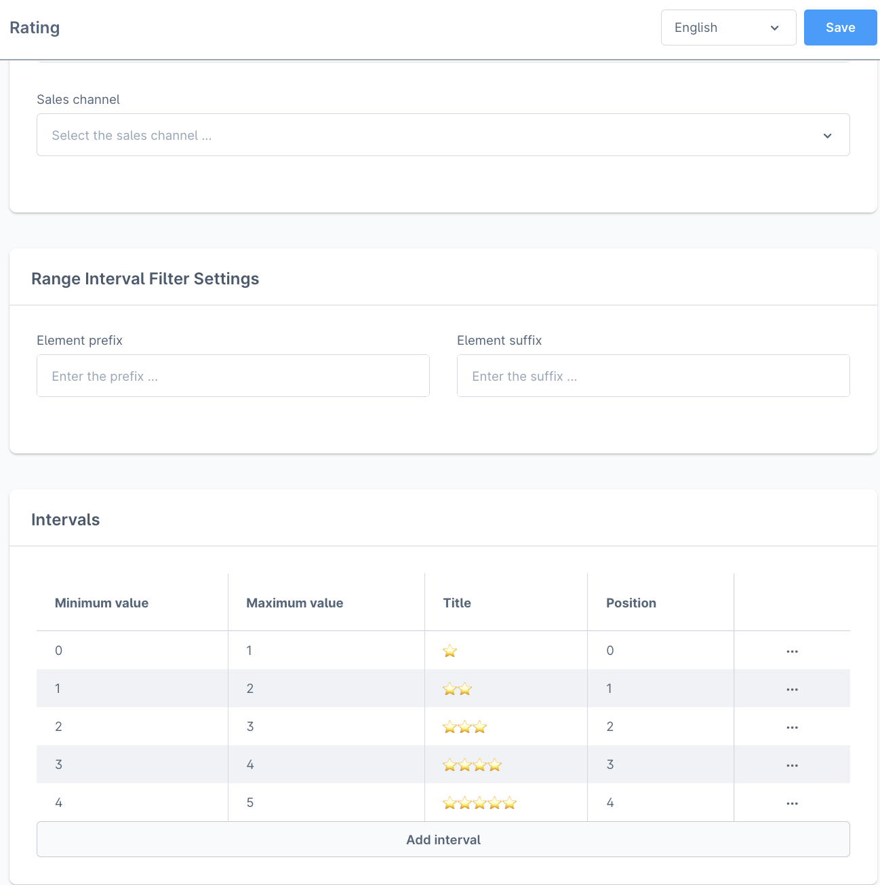

# Configurable Listing Filters

Shopware provides (mostly) hard-coded product listing filters. The templates can be overridden and new filters can be added with service events. All that requires the usage of a specifically tailored plugin.

This plugin aims to provide a more flexible way of adding filters to the product listing. Currently supported filter types are: checkbox, multi-select, range and range-interval filters (a filter with pre-defined intervals over a numeric value).

The plugin also provides the option to remove any of Shopwares nativ listing filters. To improve the performance they are not only not rendered, but the filters are also not "calculated" during the listing.

## Supported Shopware Versions

The plugin was developed and tested with Shopware `6.5`, specifically with `6.5.7.4` and `6.5.8.17`. The versioning of the plugin will follow the Shopware versions (without the `6`). E.g. the first release for Shopware `6.5` will be called `5.1.0`.

## Installing the Plugin

### Composer

The plugin can be installed from packagist using composer.

```bash
composer require it-bens/configurable-listing-filters
```

### ZIP File

Every GitHub release contains a installable ZIP file. This ZIP file can be installed the usual way in Shopware.

## Changing the Plugin Settings



- **Enable plugin**: Enable or disable the plugin
- **Position of configurable filters in filter list**: The position of the configurable filters in the filter list, relative to Shopwares native filters
- **Enable the Shopware-native manufacturer filter**: Enable or disable the Shopware-native manufacturer filter
- **Enable the Shopware-native property filter**: Enable or disable the Shopware-native property filter
- **Enable the Shopware-native price filter**: Enable or disable the Shopware-native price filter
- **Enable the Shopware-native rating filter**: Enable or disable the Shopware-native rating filter
- **Enable the Shopware-native shipping-free filter**: Enable or disable the Shopware-native shipping-free filter

## Creating a new Filter Configuration

### From a Filter Configuration Preset

The plugin provides presets for some of Shopwares native filters. Like all filters, created by this plugin, they can be configured freely after the creation.





### From the ground up

Listing filter configurations can be created for any suitable DAL field that is accessible from the product (sales channel product). The plugins assists with the choice of the field by providing a list of all fields that can be used with the current filter type. Choosing an association field will bring up a new select field while the old one gets locked. This can be reverted by clicking the "x" button on the last select field.

This example shows the settings of the manufacturer filter that was created by using the preset.



Every filter type has its own additional settings (except the checkbox filter).

#### Filter Type: Multi-Select



- **Element Sorting order**: The order of the elements in the filter. Ascending or descending.
- **Allowed Elements**: A language-specific whitelist for the elements of the filter. Every line is one whitelisted element.
- **Forbidden elements**: A language-specific blacklist for the elements of the filter. Every line is one blacklisted element.
- **Element prefix**: A language-specific prefix for the elements of the filter. The string will be inserted at the beginning of the element name.
- **Element suffix**: A language-specific suffix for the elements of the filter. The string will be inserted at the end of the element name.
- **Explicit element sorting**: A language-specific list elements. The filter will show these elements (if they are provided) in that order at the top of the list. The other elements will be sorted as configured. Every line is one element.

#### Filter Type: Range



- **Unit**: The unit of the numeric values. It is handled like a suffix.

#### Filter Type: Range Interval



- **Element prefix**: A language-specific prefix for the elements of the filter. The string will be inserted at the beginning of the element name.
- **Element suffix**: A language-specific suffix for the elements of the filter. The string will be inserted at the end of the element name.

The intervals are the elements that will be shown in the multi-select filter. An interval can have a `min`, a `max`, a `title` and a `position`. At least one of `min` or `max` must be set (not `null`). If one of them is `null`, it means that the interval has no end in this direction. The `title` is the name of the element in the list of the filter. `min` and `max` will be used for the title if no `title` is provided. The `position` indicates the order of the elements in the filter.

## Invalidating the Cache

Shopware relies heavily on caching to deliver listing pages fast and efficient. Shopware has its own `CacheInvalidatorSubscriber`. It's methods listen to the `EntityWrittenContainerEvent` and invalidate parts of the page cache based on the certain aspect they were built for. Properties/DAL fields of the product entity don't require additional invalidation because the subscriber already has a method for that. There is also a method that listens for changes of the product manufacturer.

Because this plugin allows to create listing filters on properties of other entities, listing pages have to be invalidated manually by this plugin. Therefore the plugin implements its own `CacheInvalidatorSubscriber`. It checks if a relevant entity (or translation entity) was written and invalidates all listing pages that contain at least one filter, created by this plugin and that contain a product that was (directly or indirectly) changed.

The invalidation currently doesn't consider the sales channel assignment of the listing filters.

## Reporting a problem and feature wishes

If you find a bug or have a feature wish, please open an issue on GitHub. Please provide as much information as possible. If you can, please provide a screenshot.

## Contributing
I am really happy that the software developer community loves Open Source, like I do! ♥

That's why I appreciate every issue that is opened (preferably constructive) and every pull request that provides other or even better code to this package.

You are all breathtaking!